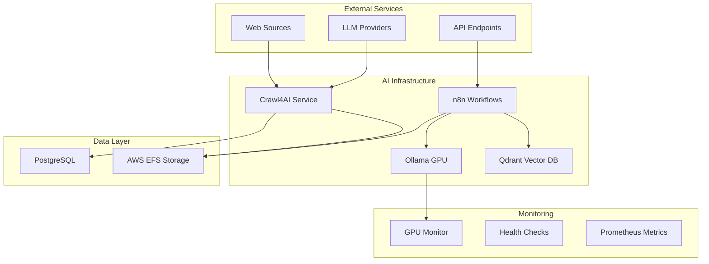

# 🚀 AI-Powered Starter Kit Deployment Strategy

A comprehensive guide for deploying GPU-optimized AI workloads with advanced web scraping capabilities.

## 📋 Table of Contents

- [Overview](#overview)
- [Architecture](#architecture)
- [Deployment Strategies](#deployment-strategies)
- [Getting Started](#getting-started)
- [Advanced Configuration](#advanced-configuration)
- [Monitoring & Operations](#monitoring--operations)
- [Troubleshooting](#troubleshooting)

## 🎯 Overview

This starter kit provides a complete AI-powered infrastructure solution featuring:

- **🧠 Advanced AI Models**: DeepSeek-R1:8B, Qwen2.5-VL:7B, Snowflake-Arctic-Embed2:568M
- **🕷️ Web Scraping**: Crawl4AI with LLM-based extraction capabilities
- **🔄 Workflow Automation**: n8n with AI agent templates
- **🗃️ Vector Database**: Qdrant for semantic search
- **🔍 Database**: PostgreSQL with performance optimization
- **☁️ Cloud-Optimized**: AWS g4dn.xlarge with spot instances for 70% cost savings

## 🏗️ Architecture



## 🚀 Deployment Strategies

### Strategy 1: Local Development (Quick Start)

**Use Case**: Development, testing, small-scale projects
**Resources**: Any machine with Docker
**Cost**: Free (local resources only)

```bash
# Clone and start basic services
git clone <repository>
cd 001-starter-kit
docker-compose up -d

# Access services
# n8n: https://n8n.geuse.io/
# Crawl4AI: http://localhost:11235
# Qdrant: http://localhost:6333
```

**Services Included**:
- ✅ n8n workflow automation
- ✅ PostgreSQL database
- ✅ Qdrant vector database
- ✅ Ollama (CPU-only)
- ✅ Crawl4AI with basic extraction

### Strategy 2: GPU-Optimized Cloud (Production)

**Use Case**: High-performance AI workloads, production deployments
**Resources**: AWS g4dn.xlarge (T4 GPU, 16GB VRAM)
**Cost**: ~$150-300/month (with 70% spot savings)

```bash
# Deploy GPU-optimized stack
EFS_DNS=fs-xxx.efs.region.amazonaws.com docker-compose -f docker-compose.gpu-optimized.yml up -d

# Services with GPU acceleration
# Ollama: Hardware-accelerated inference
# Crawl4AI: Enhanced processing capabilities
# GPU Monitoring: Real-time performance tracking
```

**Enhanced Features**:
- 🚀 GPU-accelerated AI models (8B+ parameters)
- 📊 Advanced monitoring and alerting
- 💾 EFS persistent storage
- 🔄 Auto-scaling and spot instance management
- 🛡️ Enhanced security and backup strategies

### Strategy 3: Hybrid Cloud Development

**Use Case**: Development with cloud resources
**Resources**: Local Docker + Cloud GPU instances
**Cost**: Pay-per-use cloud resources

```bash
# Local services + remote GPU
OLLAMA_BASE_URL=https://your-gpu-instance.com:11434 docker-compose up -d

# Override specific services
docker-compose -f docker-compose.yml -f docker-compose.override.yml up -d
```

## 🎬 Getting Started

### Prerequisites

```bash
# Required tools
docker --version          # >= 20.10
docker-compose --version  # >= 1.29
git --version            # >= 2.0

# For GPU deployment
nvidia-smi               # NVIDIA drivers
aws configure            # AWS CLI configured
```

### 1. Repository Setup

```bash
git clone <repository-url>
cd 001-starter-kit

# Copy environment template
cp .env.example .env
# Edit .env with your API keys and configuration
```

### 2. Choose Your Deployment Strategy

#### Option A: Local Development
```bash
make dev-up
# or
docker-compose up -d
```

#### Option B: GPU Cloud Deployment
```bash
# Set EFS DNS from AWS console
export EFS_DNS="fs-xxxxxxxxx.efs.us-east-1.amazonaws.com"

# Deploy GPU-optimized stack
make gpu-up
# or
docker-compose -f docker-compose.gpu-optimized.yml up -d
```

### 3. Initial Configuration

```bash
# Check service health
make health-check

# Initialize AI models (GPU deployment)
make setup-models

# Import n8n workflows
make import-workflows
```

### 4. Verify Deployment

```bash
# Test Crawl4AI
curl -X POST "http://localhost:11235/crawl" \
  -H "Content-Type: application/json" \
  -d '{"urls": ["https://example.com"], "extraction_strategy": "llm"}'

# Test n8n workflow
curl -X GET "https://n8n.geuse.io/healthz"

# Test Ollama models
curl -X POST "http://localhost:11434/api/generate" \
  -H "Content-Type: application/json" \
  -d '{"model": "deepseek-r1:8b", "prompt": "Hello AI!"}'
```

## ⚙️ Advanced Configuration

### AI Model Configuration

Models are automatically configured during deployment:

- **DeepSeek-R1:8B**: Optimized for reasoning and code generation
- **Qwen2.5-VL:7B**: Vision-language processing for multimodal tasks
- **Snowflake-Arctic-Embed2:568M**: High-performance embedding generation

Custom model configurations are located in `ollama/models/`:

```bash
# View model configurations
ls ollama/models/
# DeepSeek-R1-8B.Modelfile
# Qwen2.5-VL-7B.Modelfile
# Snowflake-Arctic-Embed2-568M.Modelfile

# Load custom model
docker exec ollama-gpu ollama create custom-model -f /app/models/custom.Modelfile
```

### Crawl4AI Configuration

Crawl4AI supports multiple extraction strategies:

```yaml
# crawl4ai/configs/crawl4ai-example-config.yml
extraction_strategies:
  - llm_extraction: "Use LLM for intelligent content extraction"
  - css_extraction: "Use CSS selectors for precise targeting"
  - schema_extraction: "Use Pydantic schemas for structured data"
```

### Performance Optimization

#### For GPU Instances (g4dn.xlarge)
```yaml
# Resource allocation optimized for 16GB RAM, T4 GPU
services:
  ollama-gpu:
    deploy:
      resources:
        limits:
          memory: 12G        # 75% of available RAM
          cpus: '3.5'        # 87.5% of available CPU
        reservations:
          memory: 8G
          cpus: '2.0'
```

#### For CPU-Only Instances
```yaml
# Lighter resource allocation
services:
  ollama:
    deploy:
      resources:
        limits:
          memory: 4G
          cpus: '2.0'
```

### Security Configuration

```bash
# Production security settings
export CRAWL4AI_JWT_ENABLED=true
export CRAWL4AI_RATE_LIMITING_ENABLED=true
export N8N_ENFORCE_SETTINGS_FILE_PERMISSIONS=true

# SSL/TLS configuration
make setup-ssl
```

## 📊 Monitoring & Operations

### Health Monitoring

```bash
# Comprehensive health check
make health-check

# Individual service checks
curl https://n8n.geuse.io/healthz    # n8n
curl http://localhost:11235/health    # Crawl4AI
curl http://localhost:6333/healthz    # Qdrant
curl http://localhost:11434/api/tags  # Ollama
```

### GPU Monitoring (Cloud Deployment)

```bash
# Real-time GPU metrics
docker exec gpu-monitor nvidia-smi

# Performance logs
docker logs gpu-monitor --tail 100

# Prometheus metrics
curl http://localhost:9090/metrics
```

### Log Management

```bash
# View service logs
docker-compose logs -f crawl4ai
docker-compose logs -f n8n
docker-compose logs -f ollama-gpu

# Export logs for analysis
docker-compose logs --no-color > deployment.log
```

### Backup & Recovery

```bash
# Backup persistent data
make backup

# Restore from backup
make restore BACKUP_DATE=2024-01-15

# EFS backup (automatic for cloud deployment)
aws efs describe-backup-policy --file-system-id fs-xxxxxxxxx
```

## 🎯 Use Case Examples

### 1. News Analysis Pipeline

```bash
# Deploy with news analysis configuration
docker-compose -f docker-compose.gpu-optimized.yml \
  -f examples/news-analysis.yml up -d

# Run news analysis
python crawl4ai/scripts/examples.py news_analysis
```

### 2. E-commerce Research

```bash
# Configure for e-commerce extraction
python crawl4ai/scripts/examples.py ecommerce_research
```

### 3. Academic Paper Processing

```bash
# Process academic papers with vision-language model
python crawl4ai/scripts/examples.py academic_papers
```

### 4. Social Media Monitoring

```bash
# Real-time social media analysis
python crawl4ai/scripts/examples.py social_monitoring
```

## 🔧 Troubleshooting

### Common Issues

#### Issue: GPU Not Detected
```bash
# Check NVIDIA drivers
nvidia-smi

# Verify Docker GPU support
docker run --rm --gpus all nvidia/cuda:11.0-base nvidia-smi

# Restart with GPU runtime
docker-compose down && docker-compose -f docker-compose.gpu-optimized.yml up -d
```

#### Issue: High Memory Usage
```bash
# Check memory allocation
docker stats

# Optimize for available resources
export OLLAMA_MAX_LOADED_MODELS=1
export CRAWL4AI_BROWSER_POOL_SIZE=1
```

#### Issue: Crawl4AI Connection Errors
```bash
# Check service dependencies
docker-compose ps

# Verify network connectivity
docker exec crawl4ai ping ollama-gpu
docker exec crawl4ai ping postgres

# Restart with dependency order
docker-compose down && docker-compose up -d postgres ollama-gpu crawl4ai
```

#### Issue: Model Loading Failures
```bash
# Check model status
curl http://localhost:11434/api/tags

# Force model reload
docker exec ollama-gpu ollama pull deepseek-r1:8b

# Check disk space
docker system df
```

### Debug Mode

```bash
# Enable debug logging
export CRAWL4AI_LOG_LEVEL=DEBUG
export N8N_LOG_LEVEL=debug

# Start with debug configuration
docker-compose -f docker-compose.yml -f docker-compose.debug.yml up -d
```

### Performance Tuning

```bash
# Monitor performance
make performance-test

# Optimize for your workload
make tune-performance WORKLOAD=web_scraping
make tune-performance WORKLOAD=ai_inference
make tune-performance WORKLOAD=data_processing
```

## 📚 Additional Resources

- **Crawl4AI Documentation**: `crawl4ai/CRAWL4AI_INTEGRATION.md`
- **n8n Workflow Templates**: `n8n/templates/`
- **Model Configurations**: `ollama/models/`
- **AWS Deployment Guide**: `aws-deployment/`
- **Performance Benchmarks**: `benchmarks/`

## 🤝 Contributing

1. Fork the repository
2. Create a feature branch
3. Test your changes with both deployment strategies
4. Submit a pull request with deployment impact assessment

## 📄 License

This project is licensed under the MIT License - see the LICENSE file for details.

---

## 📋 Docker Compose Modernization

### Updated to Latest Specification
All Docker Compose files have been updated to use the modern Compose Specification:

#### Key Changes Made
- ✅ **Removed deprecated `version: '3.8'` field** - No longer required in modern Compose
- ✅ **Uses Compose Specification** - Latest and recommended format
- ✅ **Docker Compose v2 compatible** - Requires v2.0+ (recommended v2.10+)
- ✅ **No custom Dockerfiles needed** - Uses official images (e.g., `unclecode/crawl4ai:latest`)

#### Benefits
- **Faster startup** - No build time for official images
- **Better maintenance** - Automatic updates from upstream
- **Improved validation** - Enhanced error checking and syntax validation
- **Future-proof** - Compatible with latest Docker features

**🚀 Ready to deploy? Choose your strategy above and get started!** 