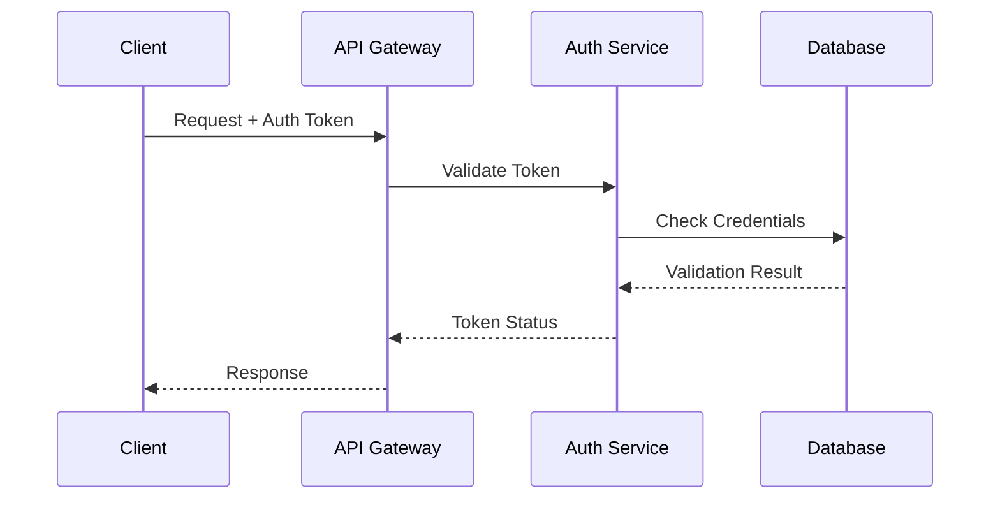

---
ai_context:
  model_requirements:
    context_window: 16k_tokens  # Standard technical documentation size
    memory_format: hierarchical  # Structured technical content
    reasoning_depth: required  # Complex technical details
    attention_focus: technical  # Implementation focus
  context_dependencies: [
    "doc_standards/01-project/02-concerns/00-security/security_policy.md",
    "doc_standards/01-project/02-concerns/01-performance/00-perf_guidelines.md"
  ]
  context_chain:
    previous: "doc_standards/01-project/00-templates/README.md"
    next: "doc_standards/01-project/00-templates/00a-examples/01-process-example.md"
  metadata:
    created: 2025-02-23 07:45:00 AM CST
    updated: 2025-02-23 07:45:00 AM CST
    version: v1.0.0
    category: technical
    status: active
    revision_id: "init-tech-example"
    parent_doc: "doc_standards/01-project/00-templates/00-ai_header.md"
    abstract: "Example technical documentation demonstrating proper AI header usage"
---

# API Authentication System
- **Path:** `doc_standards/01-project/00-templates/00a-examples/00-technical-example.md`
- **Last Updated:** 2025-02-23 07:45:00 AM CST
- **Updated by:** muLDer
- **Purpose:** Demonstrate technical documentation template usage with AI context headers
- **Version History:**
  - **v1.0.0:** Initial creation - Example technical documentation

## System Overview
This document demonstrates a technical implementation example using the AI header template.

## Architecture


## Implementation Details
```python
def validate_auth_token(token: str) -> bool:
    """
    Validates the authentication token.
    
    Args:
        token (str): The authentication token to validate
        
    Returns:
        bool: True if token is valid, False otherwise
    """
    try:
        decoded = jwt.decode(token, SECRET_KEY, algorithms=["HS256"])
        return verify_token_in_database(decoded["user_id"])
    except jwt.InvalidTokenError:
        return False
```

## Security Considerations
1. Token encryption using industry standards
2. Regular key rotation
3. Rate limiting implementation
4. Access control validation

## Performance Metrics
| Operation | Target Latency | Max Latency |
|-----------|---------------|-------------|
| Token Validation | 50ms | 100ms |
| Database Lookup | 10ms | 30ms |
| Total Request | 100ms | 200ms |

## Error Handling
```python
class AuthenticationError(Exception):
    """Base class for authentication errors."""
    pass

class TokenExpiredError(AuthenticationError):
    """Raised when the authentication token has expired."""
    pass
```

## Monitoring
- Token validation success rate
- Average response time
- Error rate by type
- System resource utilization

## References
- Security Policy
- Performance Guidelines
- System Architecture 