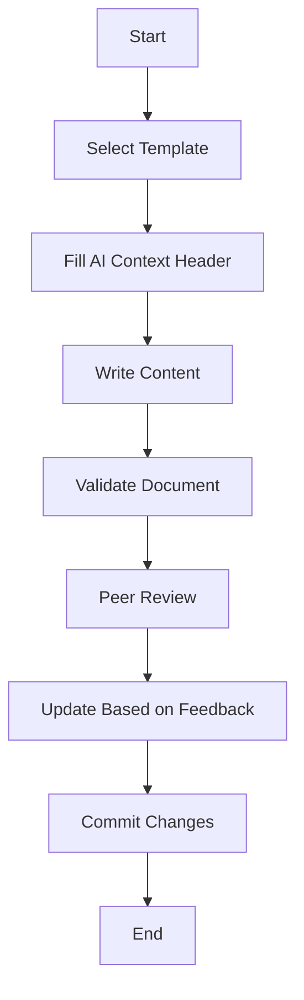

---
ai_context:
  model_requirements:
    context_window: 8k_tokens  # Simple process document
    memory_format: sequential  # Step-by-step guide
    reasoning_depth: optional  # Standard process documentation
    attention_focus: process  # Workflow focus
  context_dependencies: [
    "doc_standards/01-project/00-templates/00a-examples/00-technical-example.md"
  ]
  context_chain:
    previous: "doc_standards/01-project/00-templates/00a-examples/00-technical-example.md"
    next: "doc_standards/01-project/00-templates/00a-examples/02-analysis-example.md"
  metadata:
    created: 2025-02-23 07:45:30 AM CST
    updated: 2025-02-23 07:45:30 AM CST
    version: v1.0.0
    category: guide
    status: active
    revision_id: "init-process-example"
    parent_doc: "doc_standards/01-project/00-templates/00-ai_header.md"
    abstract: "Example process guide demonstrating proper AI header usage for workflows"
---

# Document Creation Workflow
- **Path:** `doc_standards/01-project/00-templates/00a-examples/01-process-example.md`
- **Last Updated:** 2025-02-23 07:45:30 AM CST
- **Updated by:** muLDer
- **Purpose:** Demonstrate process guide template usage with AI context headers
- **Version History:**
  - **v1.0.0:** Initial creation - Example process guide

## Prerequisites
Before starting this process, ensure you have:
1. Access to the documentation repository
2. Required template files
3. Text editor with Markdown support
4. Git client installed

## Process Flow

## Step-by-Step Guide

### 1. Select Appropriate Template
1. Navigate to `doc_standards/01-project/00-templates/`
2. Review available templates
3. Choose based on document type:
   - Technical documentation
   - Process guide
   - Analysis document

### 2. Fill AI Context Header
1. Copy template header
2. Update model requirements:
   - Set context window
   - Choose memory format
   - Define reasoning depth
   - Set attention focus
3. Update metadata fields

### 3. Write Content
1. Follow template structure
2. Add required sections
3. Include relevant diagrams
4. Add code examples if needed

### 4. Document Validation
- [ ] AI context header complete
- [ ] All required sections present
- [ ] Links validated
- [ ] Examples tested
- [ ] Diagrams render correctly

### 5. Review Process
1. Submit for peer review
2. Address feedback
3. Update document version
4. Update timestamp

### 6. Final Steps
1. Commit changes
2. Update related documents
3. Verify context chain links

## Troubleshooting

### Common Issues
1. **Invalid AI Context**
   - Solution: Verify against template guide
   
2. **Broken Links**
   - Solution: Use relative paths

3. **Rendering Problems**
   - Solution: Check Markdown syntax

## References
- AI Header Template Guide
- Documentation Standards
- Git Workflow Guide 