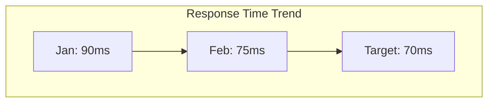
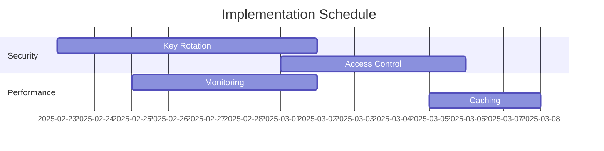

---
ai_context:
  model_requirements:
    context_window: 32k_tokens  # Complex analysis document
    memory_format: tabular  # Data-focused analysis
    reasoning_depth: required  # Detailed analysis required
    attention_focus: analysis  # Analysis-focused document
  context_dependencies: [
    "doc_standards/01-project/02-concerns/00-security/security_policy.md",
    "doc_standards/01-project/02-concerns/01-performance/00-perf_guidelines.md",
    "doc_standards/01-project/00-templates/00a-examples/00-technical-example.md"
  ]
  context_chain:
    previous: "doc_standards/01-project/00-templates/00a-examples/01-process-example.md"
    next: null
  metadata:
    created: 2025-02-23 07:46:00 AM CST
    updated: 2025-02-23 07:46:00 AM CST
    version: v1.0.0
    category: analysis
    status: active
    revision_id: "init-analysis-example"
    parent_doc: "doc_standards/01-project/00-templates/00-ai_header.md"
    abstract: "Example analysis document demonstrating proper AI header usage for system analysis"
---

# Authentication System Analysis
- **Path:** `doc_standards/01-project/00-templates/00a-examples/02-analysis-example.md`
- **Last Updated:** 2025-02-23 07:46:00 AM CST
- **Updated by:** muLDer
- **Purpose:** Demonstrate analysis template usage with AI context headers
- **Version History:**
  - **v1.0.0:** Initial creation - Example analysis document

## Executive Summary
This analysis examines the authentication system's performance, security, and reliability metrics.

## System Metrics

### Performance Analysis
| Metric | Current | Target | Status |
|--------|---------|---------|--------|
| Avg Response Time | 75ms | 100ms | ✅ |
| 95th Percentile | 150ms | 200ms | ✅ |
| Error Rate | 0.5% | <1% | ✅ |
| CPU Usage | 45% | <60% | ✅ |
| Memory Usage | 70% | <80% | ✅ |

### Security Assessment
| Component | Risk Level | Mitigation Status |
|-----------|------------|------------------|
| Token Generation | High | ✅ Implemented |
| Key Storage | Critical | ⚠️ In Progress |
| Rate Limiting | Medium | ✅ Implemented |
| Access Control | High | ✅ Implemented |

## Risk Analysis

### High Priority Issues
1. **Key Rotation System**
   - **Risk Level:** Critical
   - **Impact:** Potential system compromise
   - **Mitigation:** Implementing automated key rotation
   - **Timeline:** Complete by 2025-03-01

2. **Rate Limiting**
   - **Risk Level:** High
   - **Impact:** DoS vulnerability
   - **Mitigation:** Enhanced rate limiting
   - **Timeline:** Complete by 2025-02-28

## Performance Trends

## Recommendations

### Immediate Actions
1. Complete key rotation system
2. Implement enhanced monitoring
3. Update rate limiting rules

### Long-term Improvements
1. Migrate to hardware security modules
2. Implement distributed caching
3. Add automated failover

## Cost-Benefit Analysis
| Improvement | Cost | Benefit | ROI |
|------------|------|---------|-----|
| Key Rotation | High | Critical | 3x |
| Monitoring | Medium | High | 4x |
| Caching | Low | Medium | 5x |

## Implementation Timeline

## Dependencies
- Security Policy
- Performance Guidelines
- Technical Implementation

## Next Steps
1. Review recommendations
2. Approve timeline
3. Allocate resources
4. Begin implementation

## Appendix
- Detailed metrics data
- Testing methodology
- Resource allocation plan 