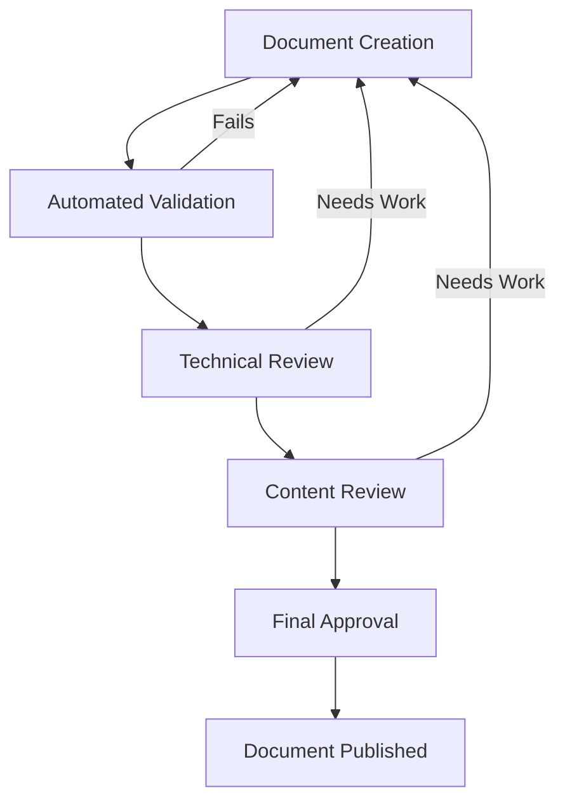

---
ai_context:
  model_requirements:
    context_window: 16k_tokens
    memory_format: sequential
    reasoning_depth: required
    attention_focus: technical
  context_dependencies: [
    "01-project/00-templates/00b-standards/00-documentation-standards.md",
    "01-project/00-templates/00b-standards/01-validation-standards.md"
  ]
  context_chain:
    previous: "01-project/00-templates/00b-standards/01-validation-standards.md"
    next: null
  metadata:
    created: 2025-02-23 02:06:00 PM CST
    updated: 2025-02-23 06:15:00 PM CST
    version: v1.0.0
    category: technical
    status: active
    revision_id: "review-standards-002"
    parent_doc: "01-project/00-templates/00-ai_header.md"
    abstract: "Technical standards for document review process and quality control"
---

# Review Standards

- **Path:** `01-project/00-templates/00b-standards/02-review-standards.md`
- **Last Updated:** 2025-02-23 06:15:00 PM CST
- **Updated by:** AI Assistant
- **Purpose:** Define technical standards for document review process
- **Version History:**
  - **v1.0.0:** Initial creation - Review standards

## System Overview
This document defines the technical standards and requirements for reviewing documentation within the system. It establishes review processes, quality control measures, and approval workflows.

## Implementation Details

### Review Process


### Review Checklist
```markdown
1. Technical Accuracy
   - [ ] Code examples are correct
   - [ ] Commands are verified
   - [ ] API references are current
   
2. Documentation Standards
   - [ ] AI context header complete
   - [ ] Required sections present
   - [ ] Links are valid
   
3. Content Quality
   - [ ] Clear and concise
   - [ ] Properly formatted
   - [ ] Examples included
```

## Security Considerations
1. **Review Access**
   - Reviewers must have appropriate permissions
   - Review comments are logged
   - Changes are tracked

2. **Approval Process**
   - Two-level approval required
   - Technical review sign-off
   - Content review sign-off

## Performance Requirements
| Review Type | Target Time | Maximum Time |
|-------------|-------------|--------------|
| Technical | 2 days | 5 days |
| Content | 1 day | 3 days |
| Final | 1 day | 2 days |

## Error Handling
1. **Review Failures**
   ```yaml
   review_failure:
     type: technical|content|final
     reason: detailed explanation
     action_items:
       - specific changes needed
       - areas to improve
       - required updates
   ```

2. **Resolution Process**
   - Document issues found
   - Assign to author
   - Track resolution
   - Re-review changes

## Monitoring and Metrics
- Review completion rate
- Average review time
- First-pass success rate
- Common issues tracked

## References
- Documentation Standards
- Validation Standards
- Review Process Guide 