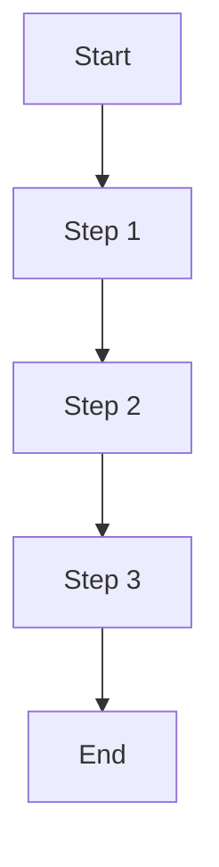

---
ai_context:
  model_requirements:
    context_window: 8k_tokens  # Standard size for guides
    memory_format: sequential  # Best for step-by-step instructions
    reasoning_depth: optional  # Basic process documentation
    attention_focus: process  # Focus on procedures
  context_dependencies: []  # List required guide documents
  context_chain:
    previous: <file_path>  # Previous guide in sequence
    next: <file_path>  # Next guide in sequence
  metadata:
    created: <YYYY-MM-DD HH:mm:ss A/PM CST>  # Creation timestamp
    updated: <YYYY-MM-DD HH:mm:ss A/PM CST>  # Last update timestamp
    version: <vX.Y.Z>  # Semantic version number
    category: guide  # Document category
    status: <draft|review|active|archived>  # Document status
    revision_id: "<commit-hash>"  # Git commit hash
    parent_doc: "<file_path>"  # Parent document
    abstract: "<High-level summary of guide content>"  # Max 100 chars
---

# <Guide Title>
- **Path:** `<document-path>`
- **Last Updated:** <YYYY-MM-DD HH:mm:ss A/PM CST>
- **Updated by:** <author>
- **Purpose:** <Brief description of the guide's purpose>
- **Version History:**
  - **<vX.Y.Z>:** <change description>

## Prerequisites
Before starting this guide, ensure you have:
1. Prerequisite 1
2. Prerequisite 2
3. Prerequisite 3

## Process Flow

## Step-by-Step Guide

### 1. First Step
1. Action 1
2. Action 2
3. Action 3

### 2. Second Step
1. Action 1
2. Action 2
3. Action 3

### 3. Third Step
1. Action 1
2. Action 2
3. Action 3

## Validation Checklist
- [ ] Check 1
- [ ] Check 2
- [ ] Check 3

## Troubleshooting

### Common Issues
1. **Issue 1**
   - Symptom: Description
   - Cause: Explanation
   - Solution: Steps to resolve
   
2. **Issue 2**
   - Symptom: Description
   - Cause: Explanation
   - Solution: Steps to resolve

## Best Practices
1. Best practice 1
2. Best practice 2
3. Best practice 3

## References
- Reference 1
- Reference 2
- Reference 3

## Related Guides
- Related guide 1
- Related guide 2
- Related guide 3 