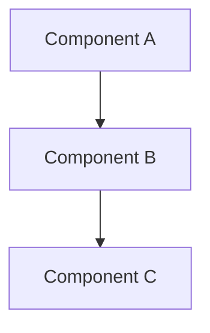

---
ai_context:
  model_requirements:
    context_window: 16k_tokens  # Standard size for technical documentation
    memory_format: hierarchical  # Best for technical documentation structure
    reasoning_depth: required  # Technical docs need detailed analysis
    attention_focus: technical  # Focus on implementation details
  context_dependencies: []  # List required technical documents
  context_chain:
    previous: <file_path>  # Previous document in sequence
    next: <file_path>  # Next document in sequence
  metadata:
    created: <YYYY-MM-DD HH:mm:ss A/PM CST>  # Creation timestamp
    updated: <YYYY-MM-DD HH:mm:ss A/PM CST>  # Last update timestamp
    version: <vX.Y.Z>  # Semantic version number
    category: technical  # Document category
    status: <draft|review|active|archived>  # Document status
    revision_id: "<commit-hash>"  # Git commit hash
    parent_doc: "<file_path>"  # Parent document
    abstract: "<High-level summary of technical content>"  # Max 100 chars
---

# <Technical Document Title>
- **Path:** `<document-path>`
- **Last Updated:** <YYYY-MM-DD HH:mm:ss A/PM CST>
- **Updated by:** <author>
- **Purpose:** <Brief description of the document's purpose>
- **Version History:**
  - **<vX.Y.Z>:** <change description>

## System Overview
[High-level description of the technical system or component]

## Architecture


## Implementation Details
```<language>
// Code example with documentation
function example() {
    // Implementation details
}
```

## Security Considerations
1. Security requirement 1
2. Security requirement 2
3. Security requirement 3

## Performance Requirements
| Operation | Target | Maximum |
|-----------|--------|---------|
| Operation 1 | target | max |
| Operation 2 | target | max |

## Error Handling
```<language>
// Error handling example
try {
    // Implementation
} catch (error) {
    // Error handling
}
```

## Monitoring and Metrics
- Key metric 1
- Key metric 2
- Key metric 3

## Dependencies
- Dependency 1
- Dependency 2
- Dependency 3

## References
- Reference 1
- Reference 2
- Reference 3

## API Reference
### Endpoints/Methods
#### `methodName(param: Type): ReturnType`
- Description
- Parameters
- Return value
- Examples

## Performance Considerations
- Bottlenecks
- Optimization strategies
- Monitoring points

## Security Considerations
- Authentication
- Authorization
- Data protection
- Audit logging

## Testing
- Unit tests
- Integration tests
- Performance tests
- Security tests

## Related Documentation
- Link to related doc 1
- Link to related doc 2

## Change Log
- [Date] - Initial creation
  - Added section 1
  - Added section 2 