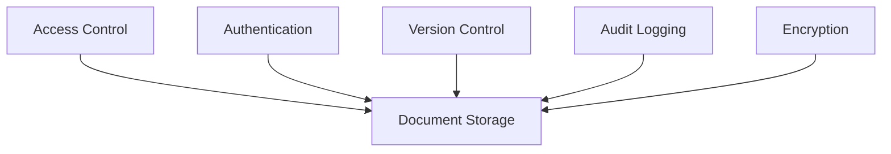

---
ai_context:
  model_requirements:
    context_window: 32k_tokens
    memory_format: hierarchical
    reasoning_depth: required
    attention_focus: technical
  context_dependencies:
    - doc_standards/01-project/00-templates/03-technical.md
  context_chain:
    previous: doc_standards/01-project/02-concerns/README.md
    next: doc_standards/01-project/02-concerns/01-performance/perf_guidelines.md
  metadata:
    created: 2025-02-22 12:15:00 PM CST
    updated: 2025-02-22 12:15:00 PM CST
    version: v0.1.0
    category: technical
    status: draft
---

# Documentation System Security Policy
Path: `doc_standards/01-project/02-concerns/00-security/security_policy.md`
Last Updated: 2025-02-22 12:15 PM CST
Updated by: muLDer

## Overview
Security architecture and implementation guidelines for the documentation system.

## Architecture
### Security Model


### Key Components
#### Access Control
- Role-based permissions
- Document-level access
- Directory restrictions

## Implementation Details
### Authentication System
```javascript
const securityConfig = {
    auth: {
        roles: ['admin', 'editor', 'viewer'],
        permissions: {
            read: ['viewer', 'editor', 'admin'],
            write: ['editor', 'admin'],
            delete: ['admin']
        }
    }
}
```

### Encryption Requirements
```javascript
const encryptionStandards = {
    atRest: 'AES-256-GCM',
    inTransit: 'TLS 1.3',
    keyRotation: '90 days'
}
```

## Security Protocols
### Document Access
- Authentication required
- Role verification
- Access logging
- Version tracking

### Data Protection
- Encryption at rest
- Secure transmission
- Backup encryption
- Key management

## Monitoring
- Access attempts
- File modifications
- Permission changes
- Security events

## Incident Response
- Detection procedures
- Response protocol
- Recovery process
- Documentation requirements

## Testing
- Access control testing
- Encryption validation
- Audit log verification
- Recovery testing

## Related Documentation
- doc_standards/01-project/02-concerns/01-performance/perf_guidelines.md
- doc_standards/01-project/05-scripts/01-project/validation_scripts.md

## Change Log
- 2025-02-22 - Initial creation
  - Defined security architecture
  - Added implementation details