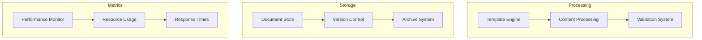

---
ai_context:
  model_requirements:
    context_window: 32k_tokens
    memory_format: hierarchical
    reasoning_depth: required
    attention_focus: technical
  context_dependencies:
    - doc_standards/01-project/04-charts/00-architecture/system_arch.md
    - doc_standards/01-project/04-charts/01-workflows/doc-flows.md
  context_chain:
    previous: doc_standards/01-project/02-concerns/00-security/security_policy.md
    next: doc_standards/01-project/02-concerns/02-maintenance/maint_policy.md
  metadata:
    created: 2025-02-22 13:15:00 PM CST
    updated: 2025-02-22 13:15:00 PM CST
    version: v0.1.0
    category: technical
    status: draft
---

# Documentation System Performance Guidelines
Path: `doc_standards/01-project/02-concerns/01-performance/00-perf_guidelines.md`
Last Updated: 2025-02-22 13:15 PM CST
Updated by: muLDer

## Overview
Performance standards and optimization guidelines for the documentation system.

## Architecture
### Performance Model


### Key Components
#### Template Processing
- Template loading: <500ms
- Content validation: <1s
- Metadata processing: <200ms

## Implementation Details
### Resource Management
```javascript
const performanceConfig = {
    template: {
        cacheSize: '100MB',
        refreshInterval: '1h',
        maxProcessingTime: '2s'
    },
    validation: {
        batchSize: 50,
        timeout: '5s',
        retryAttempts: 3
    },
    storage: {
        compressionLevel: 'medium',
        indexUpdateInterval: '15m',
        maxFileSize: '10MB'
    }
}
```

### Optimization Rules
```javascript
const optimizationRules = {
    caching: {
        templates: true,
        metadata: true,
        validationRules: true,
        refreshStrategy: 'time-based'
    },
    batching: {
        validation: true,
        indexing: true,
        archiving: true,
        batchSize: 'dynamic'
    },
    compression: {
        active: true,
        level: 'balanced',
        excludePatterns: ['*.png', '*.jpg']
    }
}
```

## Performance Standards
### Document Processing
- Template instantiation: <1s
- Content validation: <2s
- Full document creation: <5s
- Search response: <500ms

### System Operations
- Repository operations: <3s
- Validation runs: <5min
- Index updates: <1min
- Cache refresh: <30s

## Monitoring Points
### Critical Metrics
- Template processing time
- Validation duration
- Storage operations
- Search performance

### Resource Usage
- Memory utilization
- Storage consumption
- Network bandwidth
- CPU usage

## Optimization Strategies
### Content Processing
- Template caching
- Incremental validation
- Parallel processing
- Load distribution

### Storage Management
- Compression policies
- Index optimization
- Cache management
- Archive strategy

## Performance Testing
### Test Scenarios
- Bulk document creation
- Concurrent operations
- Resource stress tests
- Recovery procedures

### Validation Methods
- Load testing
- Stress testing
- Performance profiling
- Resource monitoring

## Related Documentation
- doc_standards/01-project/04-charts/00-architecture/system_arch.md
- doc_standards/01-project/04-charts/01-workflows/doc-flows.md
- doc_standards/01-project/02-concerns/00-security/security_policy.md

## Change Log
- 2025-02-22 - Initial creation
  - Defined performance standards
  - Added monitoring points
  - Established optimization strategies