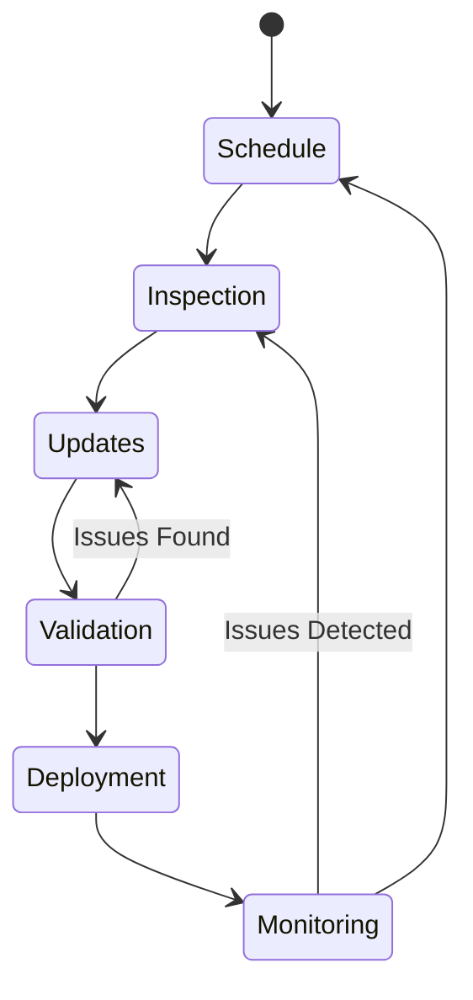
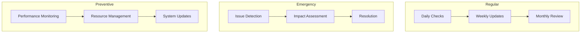

---
ai_context:
  model_requirements:
    context_window: 32k_tokens
    memory_format: hierarchical
    reasoning_depth: required
    attention_focus: technical
  context_dependencies:
    - doc_standards/01-project/02-concerns/01-performance/00-perf_guidelines.md
    - doc_standards/01-project/04-charts/00-architecture/system_arch.md
  context_chain:
    previous: doc_standards/01-project/02-concerns/01-performance/00-perf_guidelines.md
    next: doc_standards/01-project/03-plans/02-migration/00-migration_plan.md
  metadata:
    created: 2025-02-22 13:45:00 PM CST
    updated: 2025-02-22 13:45:00 PM CST
    version: v0.1.0
    category: technical
    status: draft
---

# Documentation System Maintenance Policy
Path: `doc_standards/01-project/02-concerns/02-maintenance/00-maint_policy.md`
Last Updated: 2025-02-22 13:45 PM CST
Updated by: muLDer

## Overview
Maintenance procedures and policies for the documentation system.

## Architecture
### Maintenance Workflow


### Component Maintenance


## Implementation Details
### Maintenance Schedule
```javascript
const maintenanceSchedule = {
    daily: {
        tasks: ['health_check', 'error_log_review', 'backup_verification'],
        timing: 'start_of_day',
        priority: 'high'
    },
    weekly: {
        tasks: ['performance_review', 'storage_cleanup', 'index_optimization'],
        timing: 'weekend',
        priority: 'medium'
    },
    monthly: {
        tasks: ['full_system_audit', 'dependency_updates', 'security_review'],
        timing: 'last_weekend',
        priority: 'high'
    }
}
```

### Maintenance Procedures
```javascript
const maintenanceProcedures = {
    validation: {
        frequency: 'continuous',
        checks: ['syntax', 'links', 'metadata', 'performance'],
        thresholds: {
            errors: 'zero_tolerance',
            warnings: 'review_required'
        }
    },
    optimization: {
        schedule: 'weekly',
        targets: ['templates', 'indexes', 'caches'],
        metrics: {
            performance: 'within_guidelines',
            resources: 'below_threshold'
        }
    }
}
```

## Maintenance Standards
### Regular Maintenance
- Template updates
- Content validation
- Index optimization
- Cache management

### Emergency Procedures
- Issue identification
- Impact assessment
- Resolution steps
- Recovery validation

## Monitoring Requirements
### System Health
- Performance metrics
- Resource utilization
- Error rates
- Response times

### Content Health
- Document validity
- Link integrity
- Metadata consistency
- Version alignment

## Update Procedures
### Template Updates
- Version control
- Dependency checks
- Backward compatibility
- Migration support

### Content Updates
- Validation rules
- Format verification
- Link checking
- Performance impact

## Emergency Response
### Issue Classification
- Critical: <1h response
- High: <4h response
- Medium: <24h response
- Low: <72h response

### Resolution Process
- Issue assessment
- Impact mitigation
- Solution implementation
- Verification steps

## Preventive Measures
### Resource Management
- Storage optimization
- Cache management
- Index maintenance
- Backup procedures

### Performance Optimization
- Load balancing
- Resource allocation
- Cache strategy
- Query optimization

## Related Documentation
- doc_standards/01-project/02-concerns/01-performance/00-perf_guidelines.md
- doc_standards/01-project/04-charts/00-architecture/system_arch.md
- doc_standards/01-project/04-charts/01-workflows/doc-flows.md

## Change Log
- 2025-02-22 - Initial creation
  - Defined maintenance policies
  - Added monitoring requirements
  - Established update procedures