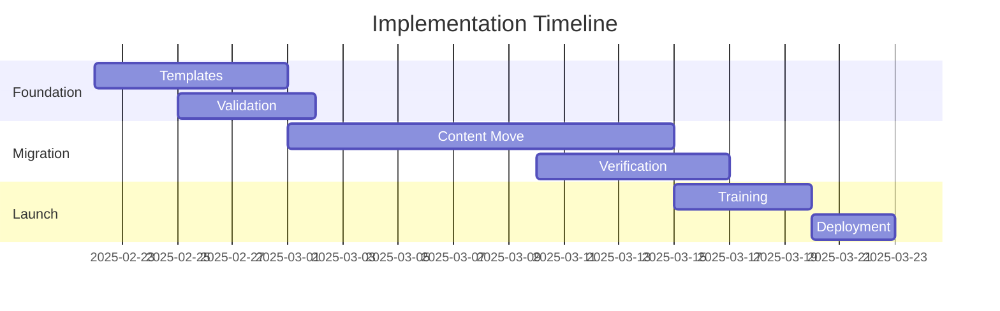

---
ai_context:
  model_requirements:
    context_window: 32k_tokens
    memory_format: hierarchical
    reasoning_depth: required
    attention_focus: technical
  context_dependencies:
    - doc_standards/01-project/00-templates/03-technical.md
    - doc_standards/01-project/03-plans/00-initial_plan.md
  context_chain:
    previous: doc_standards/01-project/03-plans/00-initial_plan.md
    next: doc_standards/01-project/03-plans/02-migration/migration_plan.md
  metadata:
    created: 2025-02-22 12:25:00 PM CST
    updated: 2025-02-22 12:25:00 PM CST
    version: v0.1.0
    category: technical
    status: draft
---

# Documentation System Implementation Plan
Path: `doc_standards/01-project/03-plans/01-implementation/impl_plans.md`
Last Updated: 2025-02-22 12:25 PM CST
Updated by: muLDer

## Overview
Technical implementation plan for the documentation system migration and enhancement.

## Architecture
### Implementation Phases


### Key Dependencies
#### Phase Dependencies
- Template completion before migration
- Validation before content move
- Verification before launch

## Implementation Details
### Phase 1: Foundation
```javascript
const foundationPhase = {
    templates: {
        setup: ['install_base', 'configure_ai', 'test_validation'],
        validation: ['syntax', 'metadata', 'links'],
        completion: ['templates_ready', 'validation_active']
    }
}
```

### Phase 2: Migration
```javascript
const migrationPhase = {
    content: {
        move: ['analyze_current', 'prepare_new', 'transfer'],
        verify: ['structure', 'metadata', 'links'],
        validate: ['ai_context', 'dependencies', 'integrity']
    }
}
```

## Technical Requirements
### System Requirements
- Git v2.30+
- Node.js v18+
- Storage capacity: 50GB
- Network bandwidth: 100Mbps

### Software Dependencies
- Version control system
- Markdown processor
- Validation tools
- Migration scripts

## Performance Metrics
- Template processing: <1s
- Content migration: <100ms/doc
- Validation runs: <5min total
- System response: <2s

## Implementation Risks
### Technical Risks
- Data loss during migration
- Validation failures
- Performance issues
- Integration problems

### Mitigation Strategies
- Automated backups
- Staged migration
- Performance monitoring
- Rollback procedures

## Testing Plan
### Test Phases
- Unit testing
- Integration testing
- Performance testing
- Security validation

### Success Criteria
- All templates validated
- Content integrity verified
- Performance metrics met
- Security requirements satisfied

## Related Documentation
- doc_standards/01-project/03-plans/00-initial_plan.md
- doc_standards/01-project/02-concerns/00-security/security_policy.md
- doc_standards/01-project/05-scripts/00-environment/setup_guide.md

## Change Log
- 2025-02-22 - Initial creation
  - Defined implementation phases
  - Added technical requirements
  - Established testing plan