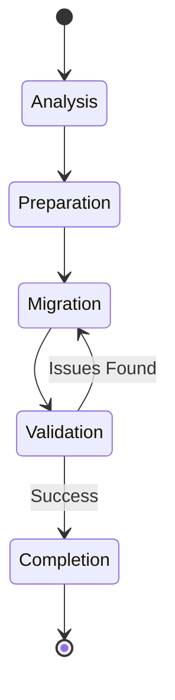
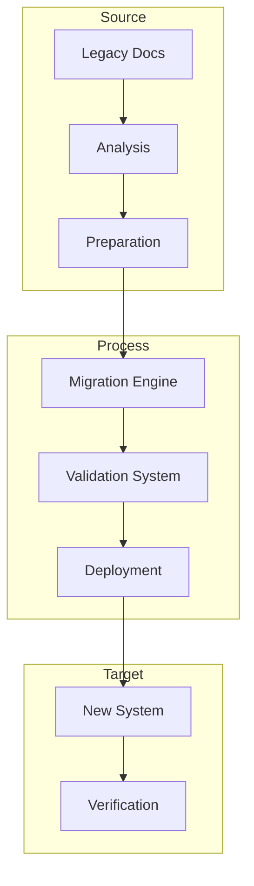

---
ai_context:
  model_requirements:
    context_window: 32k_tokens
    memory_format: hierarchical
    reasoning_depth: required
    attention_focus: technical
  context_dependencies:
    - doc_standards/01-project/03-plans/01-implementation/impl_plans.md
    - doc_standards/01-project/02-concerns/02-maintenance/00-maint_policy.md
  context_chain:
    previous: doc_standards/01-project/02-concerns/02-maintenance/00-maint_policy.md
    next: null
  metadata:
    created: 2025-02-22 14:15:00 PM CST
    updated: 2025-02-22 14:15:00 PM CST
    version: v0.1.0
    category: technical
    status: draft
---

# Documentation System Migration Plan
Path: `doc_standards/01-project/03-plans/02-migration/00-migration_plan.md`
Last Updated: 2025-02-22 14:15 PM CST
Updated by: muLDer

## Overview
Technical migration plan for documentation system implementation.

## Architecture
### Migration Process



### Resource Flow



## Implementation Details
### Migration Phases
```javascript
const migrationPhases = {
    analysis: {
        tasks: ['inventory', 'assessment', 'planning'],
        duration: '1 week',
        dependencies: ['source_access', 'tools_setup']
    },
    preparation: {
        tasks: ['template_setup', 'validation_config', 'backup'],
        duration: '1 week',
        dependencies: ['analysis_complete']
    },
    execution: {
        tasks: ['content_migration', 'metadata_update', 'link_fixing'],
        duration: '2 weeks',
        dependencies: ['preparation_complete']
    }
}
```

### Validation Rules
```javascript
const validationConfig = {
    content: {
        structure: ['templates', 'metadata', 'links'],
        format: ['markdown', 'mermaid', 'code'],
        quality: ['completeness', 'accuracy']
    },
    system: {
        performance: ['response_time', 'resource_usage'],
        integrity: ['data_consistency', 'version_control'],
        security: ['access_control', 'audit_logs']
    }
}
```

## Migration Standards
### Content Migration
- Template application
- Metadata conversion
- Link updating
- Format validation

### System Migration
- Repository setup
- Tool configuration
- Security implementation
- Performance tuning

## Validation Requirements
### Content Validation
- Structure verification
- Link integrity
- Metadata accuracy
- Template compliance

### System Validation
- Performance metrics
- Security controls
- Tool integration
- Access management

## Rollback Procedures
### Content Rollback
- Version control
- Backup restoration
- Link reversal
- Metadata reversion

### System Rollback
- Configuration restore
- Tool reversion
- Access reset
- Cache clearing

## Performance Considerations
### Migration Performance
- Batch processing
- Resource allocation
- Error handling
- Progress tracking

### System Performance
- Response times
- Resource usage
- Concurrent access
- Cache efficiency

## Security Measures
### Data Protection
- Access control
- Content encryption
- Audit logging
- Backup security

### Process Security
- Migration validation
- Integrity checks
- Version control
- Change tracking

## Monitoring Points
### Migration Monitoring
- Progress tracking
- Error detection
- Resource usage
- Performance metrics

### System Monitoring
- Health checks
- Performance stats
- Security alerts
- Access patterns

## Related Documentation
- doc_standards/01-project/03-plans/01-implementation/impl_plans.md
- doc_standards/01-project/02-concerns/02-maintenance/00-maint_policy.md
- doc_standards/01-project/02-concerns/01-performance/00-perf_guidelines.md

## Change Log
- 2025-02-22 - Initial creation
  - Defined migration architecture
  - Added implementation details
  - Established validation requirements