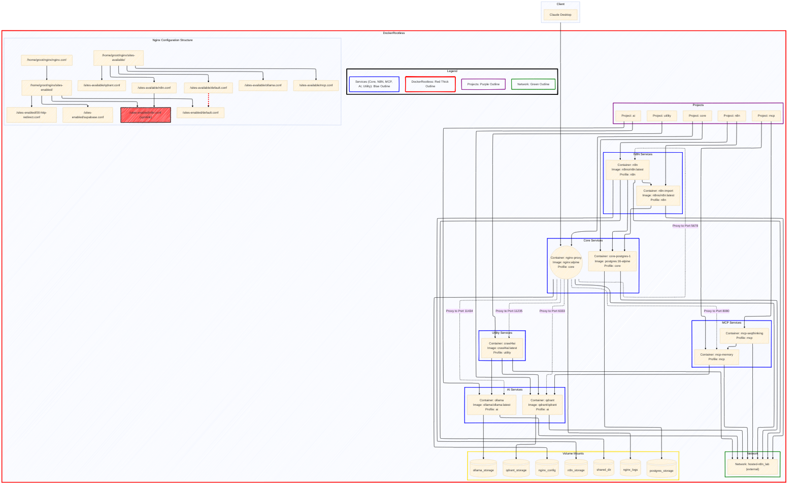

<think>
I'll create a detailed Mermaid diagram in Markdown that shows all containers, their dependencies, volume mounts, network connections, and the nginx configuration structure. This will help visualize the entire system architecture.

The diagram will need to include:
1. All containers (n8n, nginx, postgres, qdrant, etc.)
2. Project organization (core, n8n, mcp, ai)
3. Dependencies between services
4. Volume mounts (especially nginx configuration)
5. Network connections
6. Nginx configuration file structure

I'll structure this as a comprehensive Mermaid diagram with different sections.
</think>

# Container Architecture and Dependencies Diagram

Here's a detailed diagram of the containers, projects, dependencies, and configuration structure for the hosted-n8n environment:

## Startup Process and Dependencies

## Current Issue and Target State

## File Structure and Volume Mounts

This comprehensive visualization shows all containers, their project organization, dependencies, volume mounts, nginx configuration structure, and the current issues with the system. The key problems highlighted are:

1. The nginx container depends on n8n configuration but fails when n8n is unavailable
2. Symbolic links between sites-available and sites-enabled aren't properly visible in rootless containers
3. Multiple postgres instances create confusion for service connections
4. The startup sequence can create cascading failures
