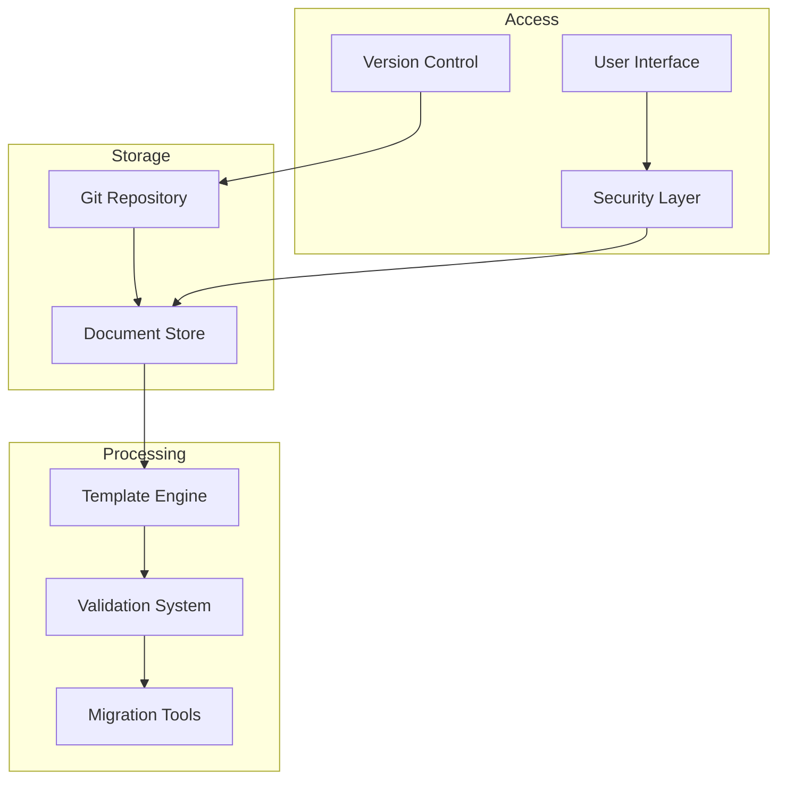
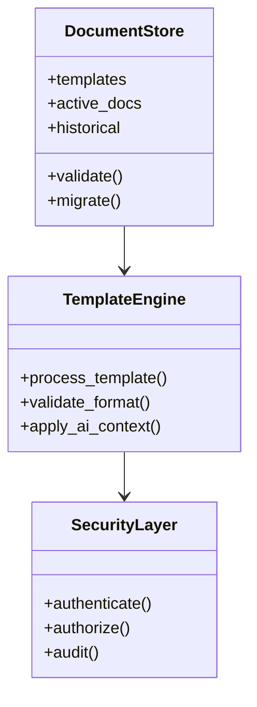

---
ai_context:
  model_requirements:
    context_window: 32k_tokens
    memory_format: hierarchical
    reasoning_depth: required
    attention_focus: technical
  context_dependencies:
    - doc_standards/01-project/00-templates/03-technical.md
    - doc_standards/01-project/03-plans/01-implementation/impl_plan.md
  context_chain:
    previous: doc_standards/01-project/04-charts/README.md
    next: doc_standards/01-project/04-charts/01-workflows/doc_flows.md
  metadata:
    created: 2025-02-22 12:35:00 PM CST
    updated: 2025-02-22 12:35:00 PM CST
    version: v0.1.0
    category: technical
    status: draft
---

# Documentation System Architecture
Path: `doc_standards/01-project/04-charts/00-architecture/system_arch.md`
Last Updated: 2025-02-22 12:35 PM CST
Updated by: muLDer

## Overview
System architecture for the documentation management system.

## System Layout
### High-Level Architecture


### Component Details


## Implementation Details
### Directory Structure
```javascript
const systemStructure = {
    root: '/doc_standards/01-project/',
    components: {
        templates: '00-templates/',
        analysis: '01-analysis/',
        concerns: '02-concerns/',
        plans: '03-plans/',
        charts: '04-charts/',
        scripts: '05-scripts/',
        technical: '',
        guides: '',
        dependencies: '',
        historical: '99-historical/'
    }
}
```

### Template Processing
```javascript
const templateEngine = {
    processors: {
        ai_context: 'process_ai_headers',
        metadata: 'validate_metadata',
        content: 'process_content',
        validation: 'run_validation'
    }
}
```

## System Components
### Document Store
- Git-based versioning
- Hierarchical structure
- Metadata indexing
- Content validation

### Template Engine
- AI context processing
- Format validation
- Content templating
- Cross-referencing

### Security Layer
- Access control
- Audit logging
- Encryption
- Authentication

## Data Flow
### Document Creation
1. Template selection
2. Metadata population
3. Content creation
4. Validation
5. Storage

### Document Access
1. Authentication
2. Authorization
3. Version selection
4. Content delivery

## Performance Architecture
### Optimization Points
- Template caching
- Validation batching
- Incremental processing
- Search indexing

### Scalability
- Horizontal scaling
- Load distribution
- Cache management
- Resource allocation

## Security Architecture
### Access Control
- Role-based access
- Document permissions
- Version control
- Audit trails

### Data Protection
- At-rest encryption
- Transit security
- Backup protection
- Key management

## Monitoring
### System Metrics
- Processing times
- Storage usage
- Access patterns
- Error rates

### Health Checks
- Component status
- Service health
- Resource usage
- Performance stats

## Related Documentation
- doc_standards/01-project/03-plans/01-implementation/impl_plan.md
- doc_standards/01-project/02-concerns/00-security/security_policy.md
- doc_standards/01-project/05-scripts/00-environment/setup_guide.md

## Change Log
- 2025-02-22 - Initial creation
  - Defined system architecture
  - Added component diagrams
  - Detailed implementation structure