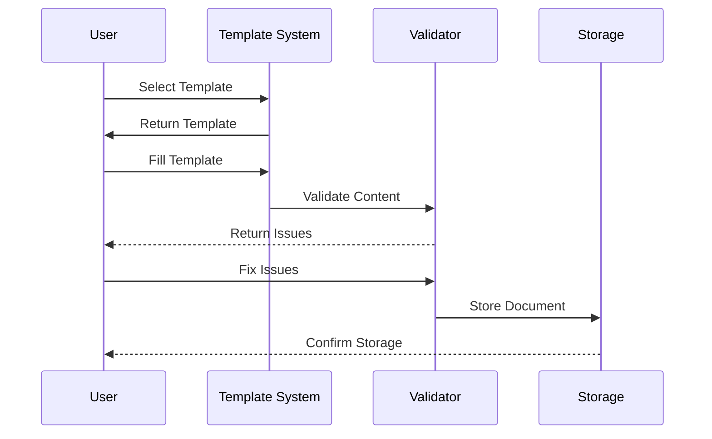
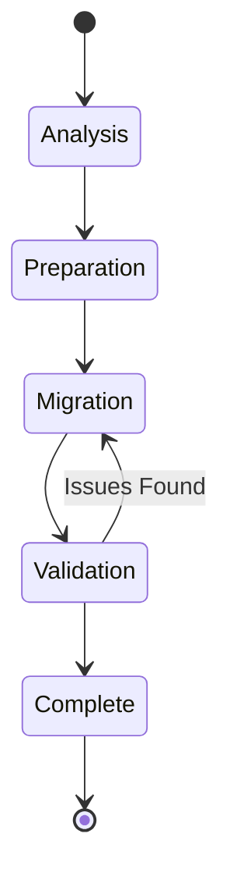
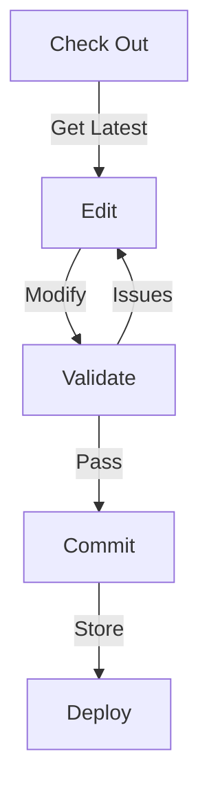

---
ai_context:
  model_requirements:
    context_window: 32k_tokens
    memory_format: hierarchical
    reasoning_depth: required
    attention_focus: technical
  context_dependencies:
    - doc_standards/01-project/00-templates/03-technical.md
    - doc_standards/01-project/04-charts/00-architecture/system_arch.md
  context_chain:
    previous: doc_standards/01-project/04-charts/00-architecture/system_arch.md
    next: null
  metadata:
    created: 2025-02-22 12:45:00 PM CST
    updated: 2025-02-22 12:45:00 PM CST
    version: v0.1.0
    category: technical
    status: draft
---

# Documentation System Workflows
Path: `doc_standards/01-project/04-charts/01-workflows/doc-flows.md`
Last Updated: 2025-02-22 12:45 PM CST
Updated by: muLDer

## Overview
Core workflow processes for the documentation system.

## Document Creation Flow


## Migration Workflow


## Update Process


## Implementation Details
### Document Lifecycle
```javascript
const documentStages = {
    creation: ['template', 'draft', 'review', 'approved'],
    updates: ['checkout', 'edit', 'validate', 'commit'],
    archival: ['mark_obsolete', 'archive', 'remove_links']
}
```

### Validation Rules
```javascript
const validationFlow = {
    stages: {
        syntax: ['markdown', 'mermaid', 'code'],
        metadata: ['ai_context', 'dependencies', 'chain'],
        content: ['structure', 'references', 'completeness']
    }
}
```

## Process Controls
### Creation Controls
- Template validation
- Content verification
- Metadata checks
- Link validation

### Update Controls
- Version check
- Lock management
- Change tracking
- Review process

## Performance Metrics
- Creation time: <5min
- Update cycle: <3min
- Validation: <1min
- Migration: <10min/doc

## Monitoring Points
### Process Monitoring
- Template usage
- Validation success
- Storage metrics
- Access patterns

### Performance Tracking
- Process times
- Error rates
- Resource usage
- User feedback

## Related Documentation
- doc_standards/01-project/04-charts/00-architecture/system_arch.md
- doc_standards/01-project/03-plans/01-implementation/impl_plan.md

## Change Log
- 2025-02-22 - Initial creation
  - Added workflow diagrams 
  - Defined process controls