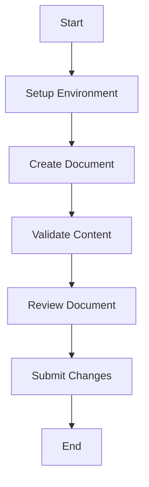

---
ai_context:
  model_requirements:
    context_window: 8k_tokens
    memory_format: sequential
    reasoning_depth: optional
    attention_focus: process
  context_dependencies: []
  context_chain:
    previous: null
    next: null
  metadata:
    created: 2025-02-23 10:25:00 AM CST
    updated: 2025-02-23 10:25:00 AM CST
    version: v1.0.0
    category: guide
    status: active
    revision_id: "test-valid-guide-001"
    parent_doc: "doc_standards/01-project/00-templates/02-guide.md"
    abstract: "Valid guide document for testing template validation"
---

# Test Guide Document

- **Path:** `01-project/05-scripts/01-project/00-validation/test_files/02-valid-guide.md`
- **Last Updated:** 2025-02-23 10:25:00 AM CST
- **Updated by:** AI Assistant
- **Purpose:** Demonstrate a valid guide document format for testing
- **Version History:**
  - **v1.0.0:** Initial creation - Valid guide document example

## Prerequisites
Before starting this guide, ensure you have:
1. Python 3.8 or higher installed
2. Access to the documentation repository
3. Basic understanding of Markdown syntax
4. Text editor with Markdown support

## Process Flow

## Step-by-Step Guide

### 1. Environment Setup
1. Clone the repository
2. Install dependencies
3. Configure editor settings

### 2. Document Creation
1. Choose appropriate template
2. Fill in metadata
3. Add required sections

### 3. Content Validation
1. Run validation script
2. Check for errors
3. Fix any issues

## Validation Checklist
- [ ] AI context header complete
- [ ] All required sections present
- [ ] Process flow diagram included
- [ ] Steps properly numbered
- [ ] Prerequisites listed

## Troubleshooting

### Common Issues
1. **Missing Sections**
   - Symptom: Validation errors
   - Cause: Incomplete template
   - Solution: Add required sections
   
2. **Invalid Metadata**
   - Symptom: Header validation fails
   - Cause: Incorrect format
   - Solution: Follow metadata guidelines

## Best Practices
1. Follow sequential steps
2. Include clear prerequisites
3. Provide troubleshooting tips
4. Maintain consistent formatting

## References
- Template validation guide
- Documentation standards
- Markdown syntax guide 