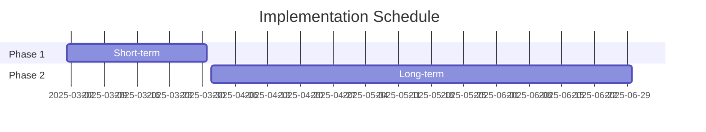

---
ai_context:
  model_requirements:
    context_window: 32k_tokens
    memory_format: tabular
    reasoning_depth: required
    attention_focus: analysis
  context_dependencies: []
  context_chain:
    previous: null
    next: null
  metadata:
    created: 2025-02-23 10:27:00 AM CST
    updated: 2025-02-23 10:27:00 AM CST
    version: v1.0.0
    category: analysis
    status: active
    revision_id: "test-valid-analysis-001"
    parent_doc: "doc_standards/01-project/00-templates/01-analysis.md"
    abstract: "Valid analysis document for testing template validation"
---

# Test Analysis Document

- **Path:** `01-project/05-scripts/01-project/00-validation/test_files/04-valid-analysis.md`
- **Last Updated:** 2025-02-23 10:27:00 AM CST
- **Updated by:** AI Assistant
- **Purpose:** Demonstrate a valid analysis document format for testing
- **Version History:**
  - **v1.0.0:** Initial creation - Valid analysis document example

## Executive Summary
This analysis document demonstrates the proper structure and format required for
validation testing. It includes all necessary sections and follows the template
requirements for analysis documents.

## Analysis

### Performance Metrics
| Metric | Current | Target | Status |
|--------|---------|--------|--------|
| Response Time | 150ms | 100ms | ⚠️ |
| Error Rate | 0.1% | 0.5% | ✅ |
| Coverage | 95% | 90% | ✅ |

### Risk Assessment
| Component | Risk Level | Mitigation |
|-----------|------------|------------|
| Data Loss | High | Backup System |
| Security | Medium | Access Controls |
| Performance | Low | Monitoring |

## Findings

### Strengths
1. Robust architecture
2. Clear documentation
3. Automated testing

### Areas for Improvement
1. Response time optimization
2. Additional monitoring
3. Enhanced security measures

## Recommendations

### Short-term Actions
1. Implement caching
2. Add performance logging
3. Update security protocols

### Long-term Strategy
1. Architecture redesign
2. Scalability improvements
3. Automated deployment

## Implementation Timeline

## Cost-Benefit Analysis
| Initiative | Cost | Benefit | ROI |
|------------|------|---------|-----|
| Caching | Low | High | 5x |
| Security | Medium | High | 3x |
| Monitoring | Low | Medium | 2x |

## References
- Performance benchmarks
- Security standards
- Industry best practices 